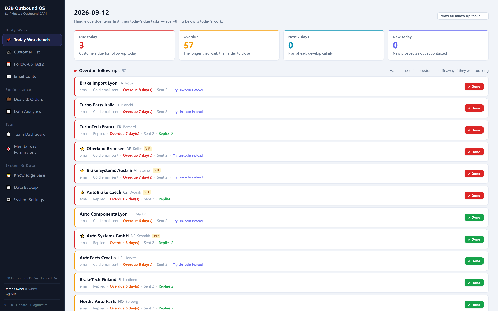
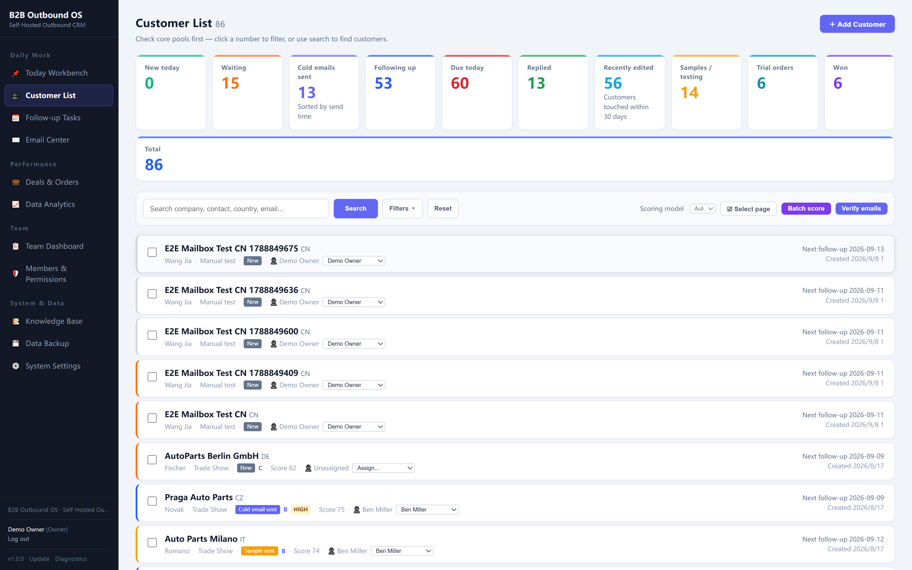
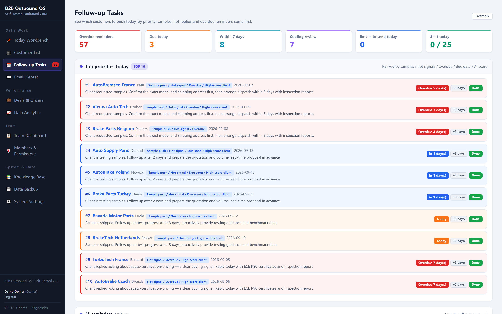
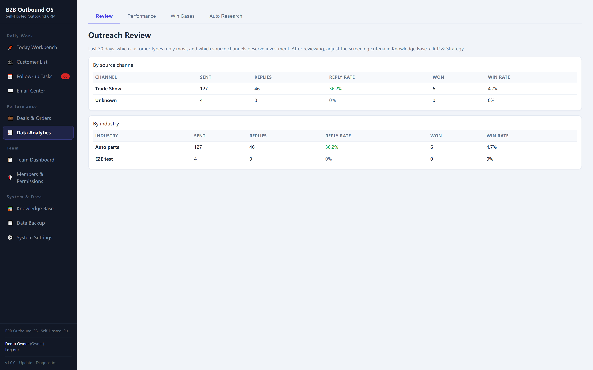

# B2B Outbound OS — Self-Hosted B2B Outbound System

> Prospect. Reach. Follow up. Close.

A self-hosted B2B outbound system for turning sales knowledge and customer lists
into a repeatable sales process. A customer list tells you who exists — this turns
it into a process that knows what to do next.

**Knowledge → ICP → Research → Scoring → Strategy → Outreach → Follow-up → Sample / Quote**

**Try the complete workflow free, in the browser — nothing to install, no signup:**
https://demo.goprospectflow.com/ — login `demo@demo.com` / `demo123456`

This repository is **documentation**: what the system does, how the workflow fits
together, and how to get it. The application itself is delivered with the
commercial license (see [Licensing](#licensing)).

## One system, from sales knowledge to closed deals

Build the system's knowledge of your products, ICP, buyer personas, industry
knowledge, buying signals and sales rules. Then research each account, score it
against your ICP, decide how to approach it, and follow the opportunity through
outreach, sample, quote and close.

**AI does not operate in a vacuum.** It uses your sales knowledge, ICP and account
context to make downstream decisions — research, scoring, strategy and messaging
all run on top of what you taught the system. The AI is the reasoning layer, not
the product.

**Not an email blaster.** It is the workflow layer that sits in front of your own
mailboxes and keeps your team moving customers forward.

## Screenshots

| Today Workbench | Customer List | Follow-up Tasks |
|---|---|---|
|  |  |  |

| Email Center | Deals & Orders | Knowledge Base |
|---|---|---|
|  |  |  |

| Data Analytics | System Settings | |
|---|---|---|
|  |  | |

## How the workflow works

1. **KNOW — teach the system how your business actually sells.** Products, ICP,
   buyer personas, value propositions, objections, buying signals and sales rules
   live in one place. The knowledge base is the system brain, not another feature.
2. **DEFINE — what a good customer looks like.** Stop treating every company on
   the list as a prospect. Define the profile that separates a high-value target
   from a waste of time.
3. **UNDERSTAND — account research first.** Website and business model, products
   and applications, LinkedIn and hiring signals, decision roles, relevant
   business signals.
4. **PRIORITIZE — an explainable score.** 0–100 against your ICP with the reasons
   visible: what fits, what is missing, which value tier the account lands in.
   Not a black-box score.
5. **DECIDE — a development strategy.** A high score is useless without a plan:
   who to approach, why now, what angle, which channel, what the next action is.
   The strategy becomes a concrete outreach plan, channel by channel.
6. **EXECUTE — put the strategy into motion.** Email, LinkedIn and WhatsApp stay
   on one customer path. No-reply rules and cooling periods make sure nothing gets
   dropped.
7. **ADVANCE — outbound doesn't end when someone replies.** Quotes, samples and
   deals stay on one record, built for B2B sales cycles where the real work starts
   after the first reply.

## What's inside

- Knowledge base: products, ICP, buyer personas, industry knowledge, buying
  signals and sales rules
- Account research: website, LinkedIn and hiring signals, decision roles
- Explainable scoring against your ICP, with value tiers
- Development strategy and multi-step outreach plans with decision-chain ordering
- Follow-up engine with no-reply rules and cooling periods
- Deals pipeline, sample tracking, quote history
- Team dashboard, daily targets and audit log
- Email center that runs on your own mailbox

## Runs on your machine

Self-hosted on Windows, macOS or Linux (Python 3.10). Your own mailbox, your own
AI key (Gemini / DeepSeek / OpenAI), local SQLite database with backups. No
telemetry, no accounts on our servers, no per-seat pricing, no subscription.

## Email integration — what works today

The email center connects to **your own mailbox** over SMTP/IMAP. There is no
sending service in the middle, no per-email fee and no markup on your mail.

| Your mailbox | Connection |
|---|---|
| Gmail (personal) | ✅ App password (2-step verification required) |
| Outlook.com / Hotmail / Live (personal) | ✅ App password |
| Google Workspace (company domain) | ✅ App password — an admin can disable app passwords |
| Zoho Mail, Alibaba Mail, Tencent Exmail | ✅ Username + password |
| Mailbox included with your web hosting (cPanel, Bluehost, HostGator, …) | ✅ Username + password |
| Self-hosted mail server (VPS, mailcow, Mail-in-a-Box, …) | ✅ Username + password |
| Microsoft 365 / Exchange Online (company domain) | ⚠️ Works after your admin enables **Authenticated SMTP** for the mailbox — one setting, steps below |

### Gmail (personal and Google Workspace)

1. Google Account → **Security** → turn on **2-Step Verification**
2. **Security → App passwords** → create one for "Mail"
3. In the app use: SMTP `smtp.gmail.com` port **465** (SSL) · IMAP
   `imap.gmail.com` port **993** (SSL) · username = full address · password =
   the 16-character app password

### Outlook.com / Hotmail / Live (personal)

SMTP `smtp-mail.outlook.com` port **587** (STARTTLS) · IMAP
`outlook.office365.com` port **993** (SSL) · password = app password (create it
after enabling two-step verification).

### Microsoft 365 / Exchange Online (company domain)

Ask your admin to enable **Authenticated SMTP** on the mailbox — 2 minutes:

```
Exchange admin center → Recipients → Mailboxes → select the mailbox
→ Email apps → tick "Authenticated SMTP" → Save
```

Or with PowerShell:

```powershell
Set-CasMailbox -Identity user@yourdomain.com -SmtpClientAuthenticationDisabled $false
```

If the mailbox uses multi-factor authentication, also create an app password.
Setup support is included with the license — email us and we will walk you (or
your IT) through it.

### Any other mailbox

Use the SMTP and IMAP host, port and password from your provider's help pages.
If your provider gives you both SSL (465/993) and STARTTLS (587/143) ports,
either works.

## Get the licensed build

**Free:** the live demo above runs the full workflow with a sample workspace, so
you can evaluate everything before paying.

**Commercial license — USD 99 one-time:**

- Complete application source code
- One-click installers for Windows / macOS / Linux
- Illustrated English setup guide
- AI install / update prompts for Codex & Claude Code
- 1 year of updates and setup support
- Team seats included

[**Buy on Gumroad**](https://crmlokal.gumroad.com/) · Website: https://goprospectflow.com

Questions before buying: **support@goprospectflow.com**

## Licensing

The software is licensed under the **Business Source License 1.1** — see
[LICENSE](LICENSE) for the full terms.

In short: evaluation and personal or internal non-commercial use are free;
production or commercial use (running it for a business, reselling it, or
charging for hosting or setup) requires the one-time **USD 99** commercial
license. On **2030-01-01** the project automatically converts to the
**Apache License 2.0**.

## FAQ

**Is the source code available?**
Yes — the complete source is delivered with the commercial license, so you (or
your developer) can read exactly what the system does before connecting a mailbox
or an AI key. It is not published in this repository; the free way to evaluate is
the live demo.

**Do I need to be technical?**
No. The paid package includes one-click installers plus an illustrated guide, and
an install prompt you can paste into Codex or Claude Code to do it for you.

**Do I have to write prompts for the AI?**
No. You fill in your knowledge base once — products, ICP, buyer personas, buying
signals, sales rules — and the system uses it for research, scoring, strategy and
messaging. Every AI draft can be edited before it is sent.

**Which email providers work?**
Any SMTP/IMAP mailbox: Gmail (app password), Outlook, Zoho, your company mail.

**What does the AI cost?**
You bring your own Gemini / DeepSeek / OpenAI key and pay the provider directly —
usually a few cents per campaign. There are no fees from us.

**Where is my data?**
In a local SQLite database on your own machine, next to the application. Backups
are local too, and can be encrypted.

**Can I run it on my own server?**
Yes — that is the point. Self-hosting is the default, not an add-on.

## Contact

- Website: https://goprospectflow.com
- Live demo: https://demo.goprospectflow.com/
- Email: support@goprospectflow.com

## Changelog

See [CHANGELOG.md](CHANGELOG.md).
